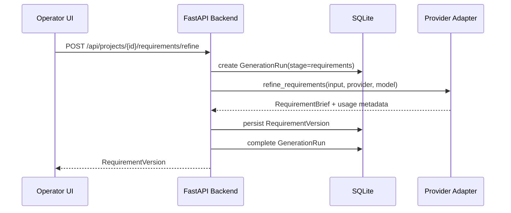
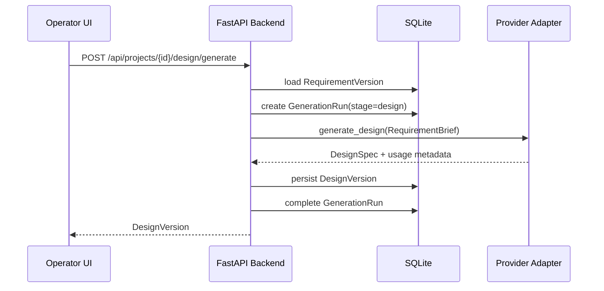
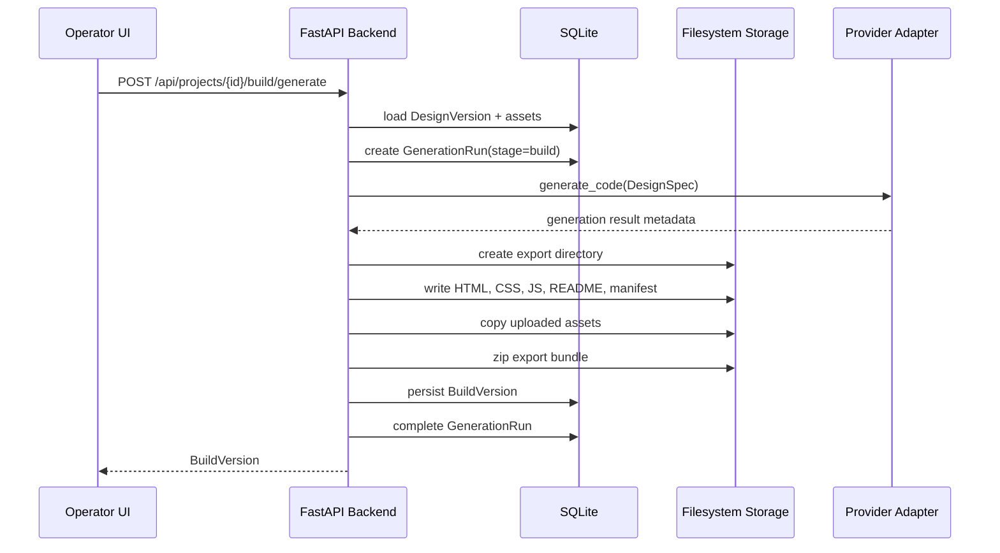

# Sequence Diagrams

## Requirement refinement

```mermaid
sequenceDiagram
    participant UI as Operator UI
    participant API as FastAPI Backend
    participant DB as SQLite
    participant PR as Provider Adapter

    UI->>API: POST /api/projects/{id}/requirements/refine
    API->>DB: create GenerationRun(stage=requirements)
    API->>PR: refine_requirements(input, provider, model)
    PR-->>API: RequirementBrief + usage metadata
    API->>DB: persist RequirementVersion
    API->>DB: complete GenerationRun
    API-->>UI: RequirementVersion
```

## Design generation

```mermaid
sequenceDiagram
    participant UI as Operator UI
    participant API as FastAPI Backend
    participant DB as SQLite
    participant PR as Provider Adapter

    UI->>API: POST /api/projects/{id}/design/generate
    API->>DB: load RequirementVersion
    API->>DB: create GenerationRun(stage=design)
    API->>PR: generate_design(RequirementBrief)
    PR-->>API: DesignSpec + usage metadata
    API->>DB: persist DesignVersion
    API->>DB: complete GenerationRun
    API-->>UI: DesignVersion
```

## Build export generation

```mermaid
sequenceDiagram
    participant UI as Operator UI
    participant API as FastAPI Backend
    participant DB as SQLite
    participant FS as Filesystem Storage
    participant PR as Provider Adapter

    UI->>API: POST /api/projects/{id}/build/generate
    API->>DB: load DesignVersion + assets
    API->>DB: create GenerationRun(stage=build)
    API->>PR: generate_code(DesignSpec)
    PR-->>API: generation result metadata
    API->>FS: create export directory
    API->>FS: write HTML, CSS, JS, README, manifest
    API->>FS: copy uploaded assets
    API->>FS: zip export bundle
    API->>DB: persist BuildVersion
    API->>DB: complete GenerationRun
    API-->>UI: BuildVersion
```
